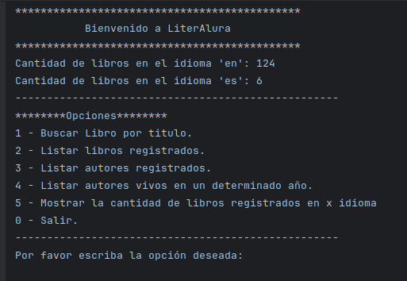
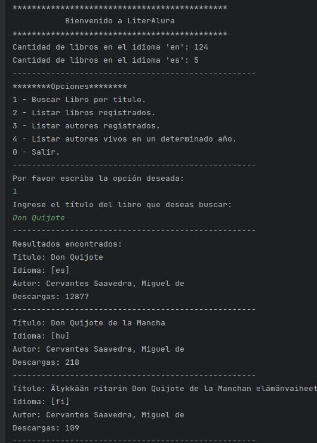
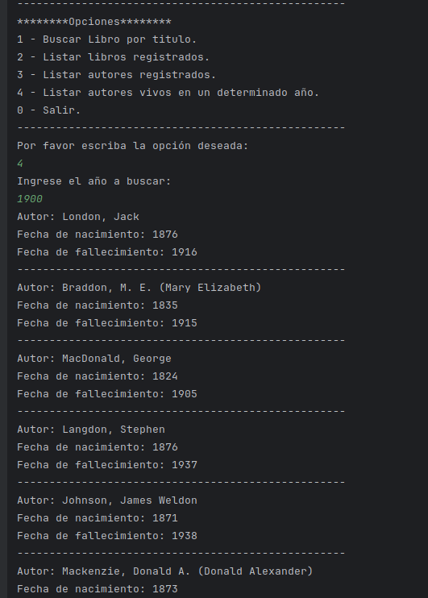
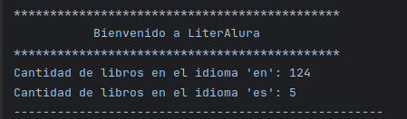

# LiterAlura

LiterAlura es una aplicación desarrollada en **Java** con **Spring Boot**, diseñada para gestionar y consultar un catálogo literario de libros y autores. Aprovecha la integración con la API de **Gutendex** para acceder a datos de libros de dominio público y ofrece una experiencia interactiva en la administración y exploración de contenido literario.

## Características principales
- **Búsquedas avanzadas**: Encuentra libros y sus autores simplemente ingresando el título.
- **Gestión de catálogo**: Registra nuevos libros y establece relaciones entre autores y sus obras.
- **Persistencia de datos**: Usa una base de datos relacional **PostgreSQL** para almacenar y consultar información de manera eficiente.
- **Integración con Gutendex**: Obtén datos actualizados en formato JSON directamente desde la API de Gutendex.
- **Generación de estadísticas**: Analiza la información del catálogo para obtener datos relevantes sobre el número de libros en diferentes idiomas y otras métricas.

## Requisitos previos
Antes de comenzar, asegúrate de tener instalados los siguientes requisitos:

- **Java 11 o superior**: Necesario para ejecutar la aplicación.
- **Spring Boot**: Framework utilizado para el desarrollo de la aplicación.
- **PostgreSQL**: Base de datos relacional utilizada para la persistencia de datos.
- **Maven**: Sistema de gestión y construcción utilizado para gestionar dependencias y ejecutar el proyecto.

## Instalación

1. **Clonar el repositorio**:
   ```bash
   git clone https://github.com/tu-usuario/literalura.git
2. **Configurar la base de datos PostgreSQL:**
  - Crea una base de datos llamada literAlura en tu servidor PostgreSQL.
  - Configura las credenciales de acceso (usuario y contraseña) en el archivo src/main/resources/application.properties:
    ```
    spring.datasource.url=jdbc:postgresql://localhost:5432/literAlura
    spring.datasource.username=tu_usuario
    spring.datasource.password=tu_contraseña
    ```
3. **Instalar dependencias: Si usas Maven, puedes instalar las dependencias del proyecto con el siguiente comando:**
      ```
      mvn install
      ```
4. **Inicia la aplicación**

## Consultas de ejemplo
### Menu principal

### 1. Búsqueda de libros por título
Puedes ingresar un título como "Don Quijote" y la aplicación buscará en la base de datos y también consultará la API de **Gutendex** para obtener información adicional como autores, idioma, descargas, etc.



### 2. Autores vivos en un año determinado
Ingresa un año (por ejemplo, 1980) y la aplicación te devolverá una lista de autores que estaban vivos en ese año.



### 3. Estadísticas de libros por idioma
Esta funcionalidad permite mostrar la cantidad de libros cargados en la base de datos filtrados por idioma. Por defecto, la aplicación está configurada para mostrar estadísticas en español e inglés en la pantalla de inicio. Puedes seleccionar el idioma que deseas consultar y la aplicación te mostrará el número total de libros disponibles en ese idioma en el catálogo.


